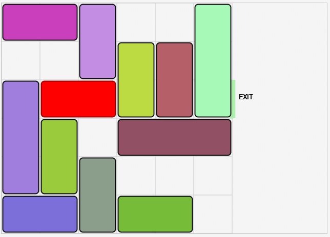

# 🚗 Rush Hour Puzzle Solver

Program ini menyelesaikan permainan puzzle **Rush Hour** menggunakan beberapa algoritma pathfinding, yakni A\* Search, Uniform Cost Search (UCS), dan Greedy Best First Search. Dilengkapi dengan GUI interaktif dan animasi solusi.



---

## 📌 Gambaran Umum

**Rush Hour** adalah permainan puzzle di mana pemain harus memindahkan mobil utama (biasanya berwarna merah) ke pintu keluar dengan cara menggeser mobil lain yang menghalangi jalan.

Program ini menyediakan:

- Solver puzzle menggunakan algoritma pencarian terinformasi & tak terinformasi
- GUI interaktif berbasis JavaFX
- Visualisasi dan animasi solusi langkah demi langkah
- Statistik performa algoritma
- Fitur ekspor solusi ke file teks

---

## 🧠 Fitur Utama

- **Beberapa Algoritma Pencarian** : A\* Search, Uniform Cost Search (UCS), dan Greedy Best First Search.

- **Heuristik yang Tersedia** : Manhattan Distance dan Blocking Cars.

- **GUI Interaktif**

  - Visualisasi papan & pergerakan mobil
  - Slider animasi langkah-langkah
  - Kontrol navigasi (Next, Prev, Play, Pause)

- **Statistik Solusi** : Jumlah node dikunjungi, Waktu eksekusi, dan Jumlah langkah.

- **Ekspor Solusi** : Simpan solusi ke file `.txt`

---

## ⚙️ Persyaratan Sistem

- Java Development Kit (JDK) 11 atau lebih tinggi
- JavaFX SDK 11 atau lebih tinggi
- Maven (opsional, tapi direkomendasikan untuk kemudahan run)

---

## 🚀 Cara Menjalankan Program

Terlebih dahulu, clone repository :

```
git clone https://github.com/Rejaah/Tucil3_13523068_13523119.git
```

### ✅ Opsi Praktis: Menggunakan Maven (Direkomendasikan)

Jika kamu sudah mengatur proyek menggunakan Maven dan JavaFX, cukup jalankan:

```bash
mvn clean javafx:run
```

> **Pastikan** file `pom.xml` sudah menyertakan dependency JavaFX yang sesuai.

---

### 💻 Opsi Manual (Jika Tidak Menggunakan Maven)

1. Arahkan ke direktori root proyek:

   ```bash
   cd Tucil3_13523068_13523119
   ```

2. Buat folder untuk file hasil kompilasi:

   ```bash
   mkdir -p bin
   ```

3. Kompilasi file utama:

   ```bash
   javac -d bin -cp <path-to-javafx>/lib/* --module-path <path-to-javafx>/lib --add-modules javafx.controls,javafx.fxml,javafx.graphics -sourcepath src src/gui/Launcher.java
   ```

4. Jalankan program:
   ```bash
   java --module-path <path-to-javafx>/lib --add-modules javafx.controls,javafx.fxml,javafx.graphics -cp bin gui.Launcher
   ```

---

## 🧭 Cara Menggunakan Program

1. **Jalankan aplikasi**: GUI akan muncul
2. **Muat Puzzle**: Klik `Select Puzzle File`, lalu pilih file `.txt` sesuai format:

   ```
   Baris Kolom
   Jumlah Mobil
   Konfigurasi Papan
   ```

   - `P` = Mobil utama
   - `K` = Pintu keluar
   - Huruf lain = Mobil penghalang
   - `.` = Sel kosong

3. **Pilih algoritma**: UCS, A\*, atau Greedy
4. **Pilih heuristik** (jika A\*/Greedy): Manhattan atau Blocking Cars
5. **Klik "Run Solver"**: Lihat animasi solusi
6. **Gunakan kontrol animasi**: Play, Next, Prev, dan slider
7. **Klik "Save Solution"**: Ekspor solusi ke file teks

---

## 👨‍💼 Penulis

| Nama                 | NIM      |
| -------------------- | -------- |
| Muh. Rusmin Nurwadin | 13523068 |
| Reza Ahmad Syarif    | 13523119 |

---
